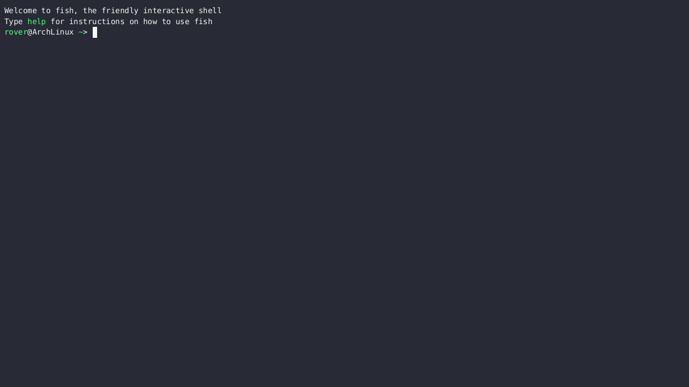
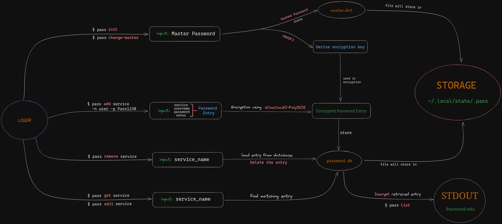

# pass_rs

Pass is a simple and secure password manager written in Rust, designed to help you store and manage your passwords with ease. It offers features like password generation, encryption, and a user-friendly command-line interface.

## Table of Contents

- [Project Features](#project-features)
- [Installation](#installation)
- [CLI Interface](#cli-interface)
- [Usage](#usage)
- [How it works](#how-it-works)
- [Contributing](#contributing)
- [License](#license)

### Project Features

- **Password Management**: Store and organize your passwords securely.
- **Password Generation**: Easily create strong and random passwords with customizable options.
- **Encryption**: All stored passwords are encrypted for enhanced security. Encryption is done using `XChaCha20-Poly1305`.
- **Command-Line Interface**: A user-friendly and scriptable CLI for quick access to your passwords.

### Installation

To install `pass`, you need to have [Rust](https://www.rust-lang.org/tools/install) installed.  
Then, you can use below cargo command to install `pass_rs` as follows:

```bash
cargo install --git https://github.com/IshanGrover2004/pass.git
```

### CLI Interface

```rust
A easy-to-use CLI password manager

Usage: pass_rs [COMMAND]

Commands:
  init           Initialize the pass
  change-master  Change Master password
  add            Make a new password
  remove         Remove a password
  update         Update a password
  list           List all made password
  get            Get a password entry
  search         Fuzzy search passsword entries
  gen            Generate a password
  reset          Reset features for pass directory
  help           Print this message or the help of the given subcommand(s)

Options:
  -h, --help     Print help
  -V, --version  Print version
```

### Usage

<!--  -->

<a href="https://asciinema.org/a/ku4nII6uyxqxkYQMxuozIyD4d" target="_blank"></a>

### How it works



### TODOs
- [ ] Add test coverage for every functions & modules
- [ ] Make use of Sqlx crate for creating database
- [ ] Make repl
- [ ] Make `--sort` flag for list entries in sorted manner
- [ ] Refacter code to look more cleaner code(I guess done)

### Contributing

Contributions are welcome! If you’d like to contribute, please feel free to open an issue or submit a pull request. Checkout our [CONTRIBUTING](./CONTRIBUTING.md) file for details on how to contribute.

### License

This project is licensed under the MIT License. See the [LICENSE](./LICENSE) file for details.
